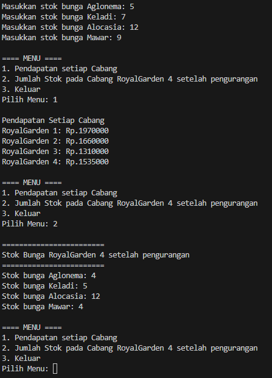

|  | Algoritma dan Struktur Data |
|--|--|
| NIM |  244107020239|
| Nama |  Rivan Fahlul Fadillah |
| Kelas | TI - 1H |
| Repository | [link] ( ) |

# JOBSHEET 1

## 2.1.1 Pemilihan

Hasil Kode Program Pada Percobaan Pemilihan

Langkah-Langkah Kode Program :
1. Menginput Nilai Tugas, Nilai Kuis, Nilai UTS, dan Nilai UAS
2. Jika ada nilai yang lebih dari 100, program akan memberikan output atau hasil yang berisi
 "Nilai Tidak Valid" 
3. Sedangkan jika ada nilai yang tidak lebih dari atau sama dengan 100, maka program akan memilih  Nilai Huruf yang diperoleh adalah A, B+, B, C+, C maka dinyatakan "SELAMAT ANDA LULUS", jika nilai huruf D dan E akan menyatakan bahwa "TIDAK LULUS".

## 2.2.1 Perulangan

Hasil Kode Program Pada Percobaan Perulangan

Langkah-Langkah Kode Program :
1. Program meminta untuk memasukkan NIM
2. Menginput nilai n
3. Jika n kurang dari 10, maka 10 ditambahkan ke nilai n
4. Perulangan for berjalan dari 1 hingga n.
5. Jika i = 6 atau i = 10, maka perintah continue akan dilewati (angka 6 dan 10 tidak dicetak).
6. Jika i adalah bilangan ganjil, cetak "* ".
7. Jika i adalah bilangan genap, cetak angka i.

## 2.3.1 Array

Hasil Kode Program Pada Percobaan Array

Langkah-Langkah Kode Program :
1. Inisialisasi Data Mata Kuliah
2. Inisialisasi Variabel untuk Perhitungan IP
3. Menampilkan Header Program
4. Menghitung IP Semester
5. Menampilkan Hasil Konversi Nilai
6. Fungsi Konversi Nilai Angka ke Huruf
7. Fungsi Konversi Nilai Huruf ke Bobot Nilai

## 2.4.1 Fungsi

Hasil Kode Program Pada Percobaan Fungsi

Langkah-Langkah Kode Program :
1. Deklarasi Variabel dan Array
2. stokBunga[][] → Menyimpan jumlah stok bunga di setiap cabang.
namaBunga[] → Nama jenis bunga yang tersedia.
hargaBunga[] → Harga jual setiap jenis bunga.
stokPengurangan[] → Jumlah bunga yang mati dan dikurangkan dari stok cabang ke-4.
3. oop pertama (for) digunakan untuk mengiterasi 4 cabang RoyalGarden.
Loop kedua (for) menerima input stok untuk 4 jenis bunga di setiap cabang.
4. Loop while (true) memastikan menu akan terus berjalan sampai pengguna memilih keluar.
Menampilkan 3 pilihan menu
5. Menggunakan switch-case untuk Menjalankan Fitur
6. Fungsi Menghitung Pendapatan
7. Fungsi Menampilkan Stok Cabang 4 Setelah Pengurangan

------------------------------------------------------------------------------------------------

## 3.1.1 Tugas1

Hasil Kode Program Pada Percobaan Tugas1

Langkah-Langkah Kode Program :
1. Mendeklarasikan Array dan Kota
2. Array kode menyimpan daftar karakter plat nomor yang tersedia
3. Array kota adalah array dua dimensi yang menyimpan nama kota dalam bentuk karakter per karakter
4. Program meminta pengguna memasukkan satu huruf kode plat nomor
5. Perulangan for digunakan untuk mencari apakah inputKode cocok dengan salah satu nilai dalam array kode
6. Jika ditemukan masih false setelah perulangan, berarti kode plat tidak ada dalam daftar.
7. Program mencetak "Kode tidak ditemukan!"

## 3.2.1 Tugas2

Hasil Kode Program Pada Percobaan Tugas2

Langkah-Langkah Kode Program :
1. Menghitung volume kubus,luas permukaan,keliling dengan rumus
2. Meminta pengguna memasukkan panjang sisi kubus dalam bentuk angka (double)
3. Menampilkan daftar perhitungan yang dapat dipilih oleh pengguna
4. Menerima pilihan dari pengguna dalam bentuk angka 
5. Menggunakan switch-case untuk memilih perhitungan yang sesuai berdasarkan input pengguna

## 3.3.1 Tugas3

Hasil Kode Program Pada Percobaan Tugas3

Langkah-Langkah Kode Program :
1. Inisialisasi sc dan jumlah matkul
2. Menerima input data Matkul
3. Menampilkan menu pilihan
4. switch case untuk menampilkan seluruh jadwal kegiatan
5. ika pengguna memasukkan pilihan yang tidak tersedia, program akan mencetak "Pilihan tidak valid.

